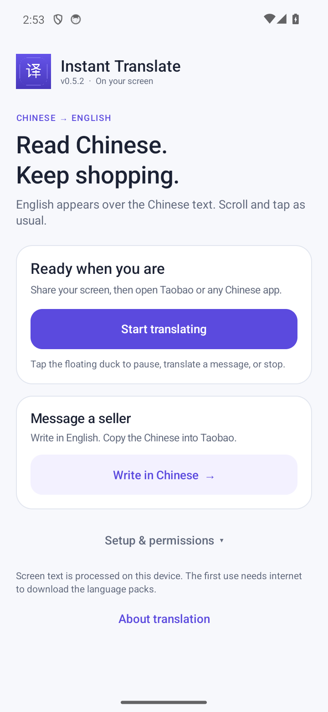
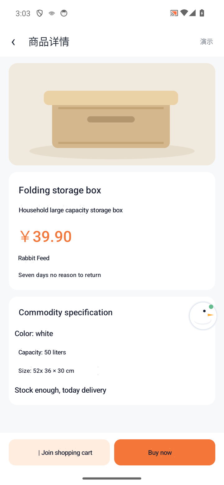
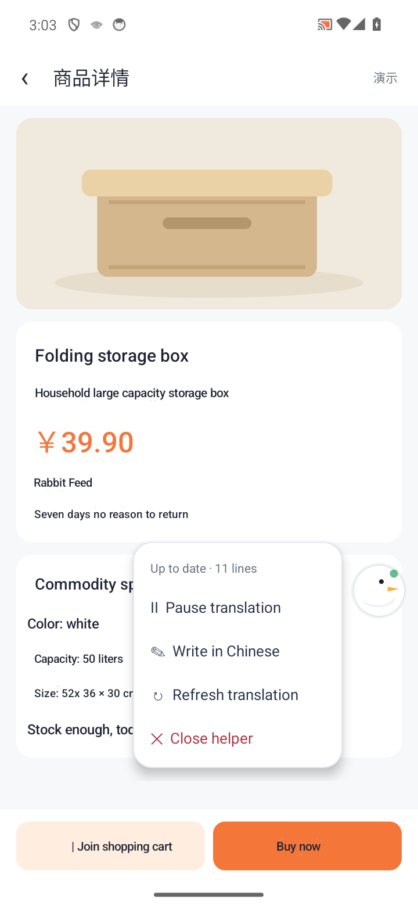
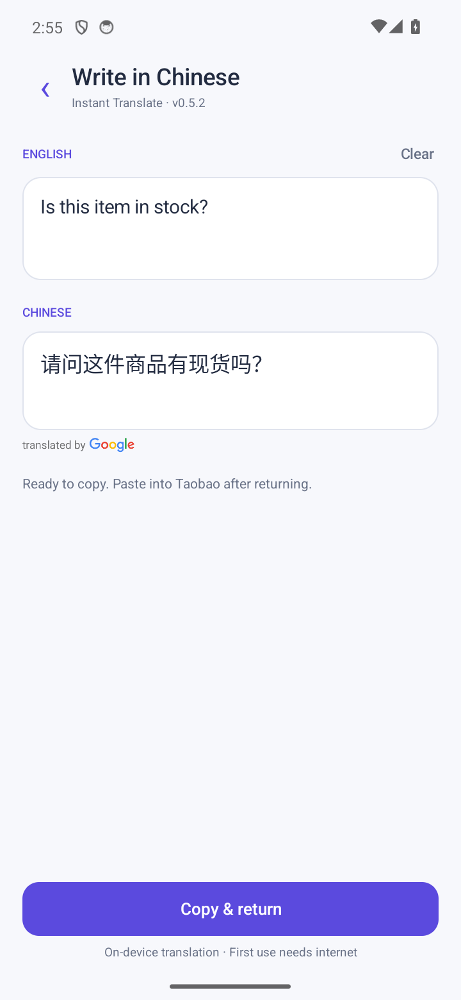

# Instant Translate

[](https://github.com/darren236/instant-translate/actions/workflows/android.yml)

**Chinese → English over your Android apps.** Instant Translate is a portfolio prototype that draws translations over visible Chinese text, with a draggable duck for controls and an English → Chinese shopping-message composer.

Android 8.0+ · v0.5.2 · ML Kit on-device OCR and translation · [MIT license](LICENSE)

## What it does

- Places English at detected Chinese text locations while taps and scrolling reach the app underneath.
- Waits for scrolling/motion to settle and reuses unchanged translation views.
- Lets you drag, pause, resume, refresh, or close the floating helper.
- Saves message drafts and offers quick seller questions with **Copy & return**.
- Runs OCR and translation on-device after the initial language-model download.

## Screenshots

| Start a session | Translate on screen |
| --- | --- |
|  |  |

| Floating helper controls | Write a shopping message |
| --- | --- |
|  |  |

Captured from v0.5.2 on an Android 14 emulator. The shopping screen is synthetic demonstration content, not live Taobao. [Screenshot and test details](docs/VERIFICATION.md).

## Build and try it

Requirements: **JDK 17**, **Android SDK platform 35 / Build Tools 35.0.0**, and **Python 3** for packaging. The included Gradle wrapper downloads Gradle.

```sh
git clone https://github.com/darren236/instant-translate.git
cd instant-translate
bash build-android.sh
adb install -r outputs/InstantTranslate-v0.5.2-debug.apk
```

These commands are for macOS/Linux. For SDK setup, Android Studio, Windows, and test commands, see the [development guide](docs/DEVELOPMENT.md).

1. For solid text replacement, expand **Setup & permissions → Improve text overlays** and enable Instant Translate in Android Accessibility settings. Otherwise, allow **Display over other apps** for the partially transparent fallback.
2. Tap **Start translating** and approve Android screen sharing. Notifications are optional.
3. Open an app with Chinese text and stop scrolling to let it translate.
4. Tap the duck for controls. **Close helper** ends the session; **Write in Chinese** opens the composer.

The first translation session downloads language packs. Translation then works offline; the shopping app may still need internet.

## How it works

**Screen capture → Chinese OCR → on-device translation → positioned overlay.**

Frame samples and optional accessibility events trigger scans after a quiet period. Translations are cached, and completed results appear as they finish. The [code map](docs/DEVELOPMENT.md#code-map) explains the main classes.

## Permissions and privacy

- **Screen sharing:** captures visible pixels with Android's consent; protected screens cannot be captured.
- **Accessibility or display over other apps:** hosts the translation overlay. Accessibility also supplies content-change events; it does not read the view hierarchy or perform gestures.
- **Notifications (optional):** provides Pause/Resume and Stop controls.

Captured frames are processed in memory, not saved or sent to a translation server. Composer drafts stay in private app storage; Android backup is disabled. No translation API key is needed.

## Status and limitations

Build, signature verification, **19 JVM tests**, and **3 Android bitmap tests** passed for v0.5.2. GitHub CI builds a fresh checkout and runs the JVM tests and lint; device tests were run separately. [Verification record](docs/VERIFICATION.md).

- OCR can miss small or stylized text; translations can be inaccurate or shortened.
- Continuous animation can delay automatic scans. Use **Refresh translation** when needed.
- Without Accessibility, changes hidden beneath existing translations may need a manual refresh.
- Live Taobao and Android 8–9 still need broader device testing.
- Google attribution placement for the live overlay remains an unresolved release finding. See the [code review](CODE_REVIEW.md).

## Further reading

[Development and contributions](docs/DEVELOPMENT.md) · [Changelog](docs/CHANGELOG.md) · [Code review](CODE_REVIEW.md)

Translation uses [Google Translate through ML Kit](https://developers.google.com/ml-kit/language/translation/android). See its [usage guidelines](https://developers.google.com/ml-kit/language/translation/translation-terms) and [attribution requirements](https://docs.cloud.google.com/translate/attribution).

Application code is [MIT licensed](LICENSE). Dependencies, Gradle wrapper files, and Google brand assets retain their own licenses and usage requirements.
